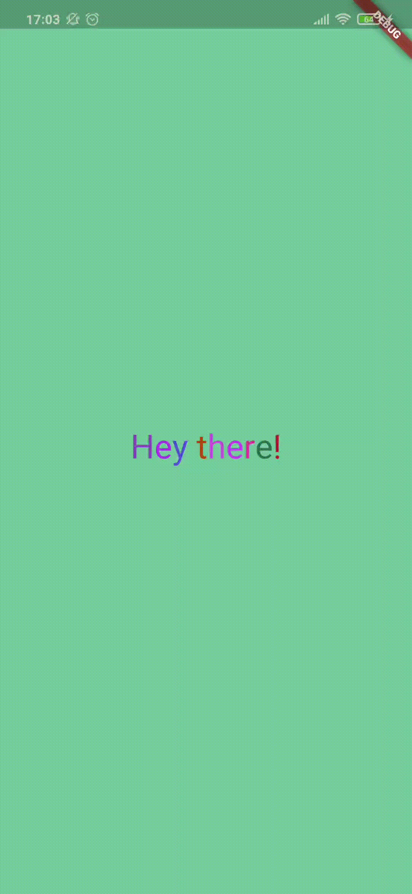

# hey_there_app

This Flutter application displays the text "Hey there" in the middle of the screen. Tap anywhere and a background color will change.

## Features of the project

* The application has its own icon;

* Random text color for each letter.

## Getting started

For help getting started with Flutter, view
[online documentation](https://flutter.dev/docs), which offers tutorials, samples, guidance on mobile development, and a full API reference.
